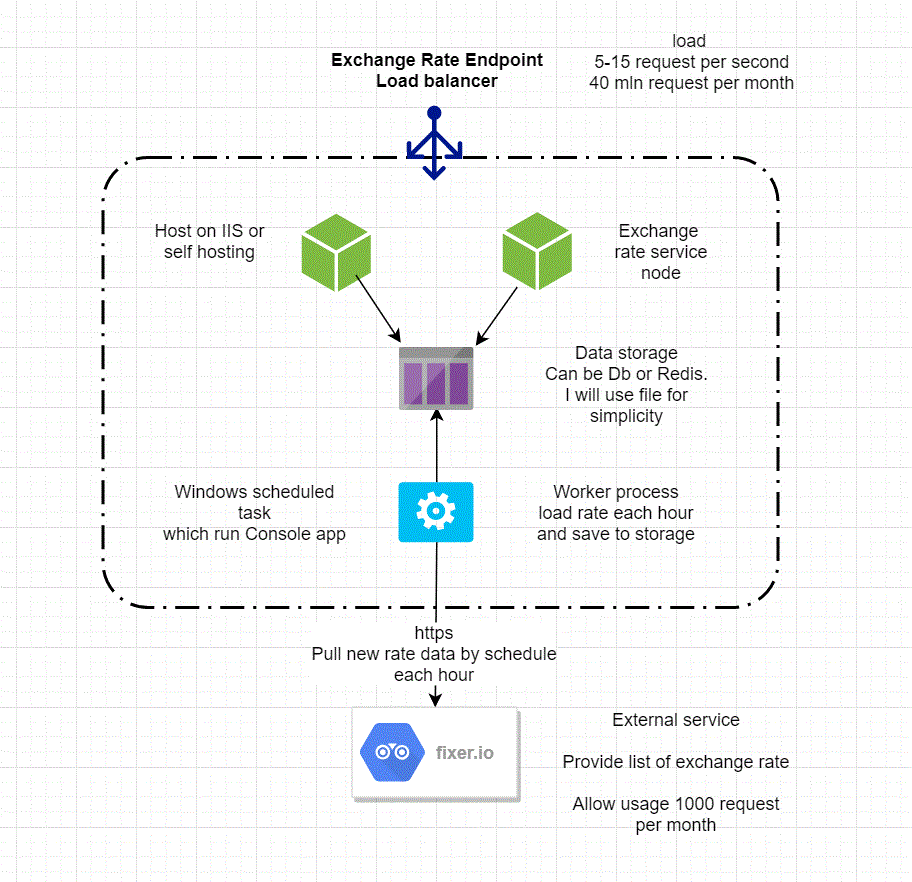

#Setup Instructions: 
Run ExchangeRateDownloader consol application as Windows Schedule Task (once an hour)
Run ExchangeRateService as consol app or in IIS
Access service https://localhost:5001/v1/exchangerate/convert/basecurrency/usd/targetcurrency/aud

#Design

#Decisions and assumptions
To keep request rate under the limit and because we have multiple service nodes, worker process was introduced.
Also worker process will help if external service is offline. We can use existing data.

### Worker process - ExchangeRateDownloader
Read new rates from external api based on schedule and save exchange pairs into storage.
Based on fixer:
    -1.000 API Calls
    -Hourly Updates
Service will read data once an hour. In this case it will be 720 calls per month which is below 1000 limit.
Conversion rate should be with 5 decimal places precision

For Windows we can use Schedule Task

###Storage
For simplicity i will use network folder share with files. 
Each hour service will download and create new file with new rates with tmp extension and after writing completed will rename file to txt extension.
File name format: exchangerates_2018111013.txt
To make storage work default user temp directory should be accessible by tests and user account used to run Worker and Web Api Services

What need to be done in future: Another service which will cleanup or archived the files after one day should be introduced.

###Service node - ExchangeRateService
Self hosted rest service in console. 
Upon request read rate data from storage.
Will cache information for 5 minutes in local cache.
Use swagger for service description.
